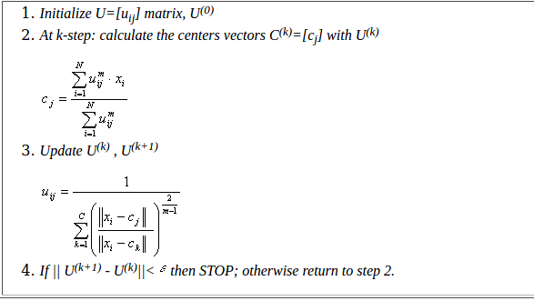
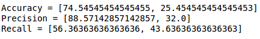
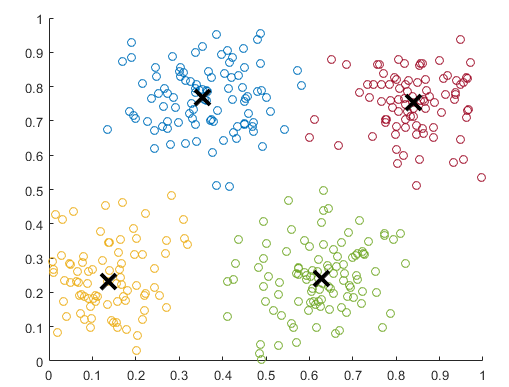

# Fuzzy-C-Means-Clustering

 <b>Shristi Kedia(BITS Pilani)</b> 

This project is part of an Assignment on Fuzzy C-means Clustering. It aims at analyzing Fuzzy C-means clustering algorithm and work on its application in the field of image recognition using Python.

# Introduction

### **Clustering**

Clustering is a method by which set of points in a given data set are divided into groups of similar objects. The main goal of clustering involves assigning data points to clusters such that items in the same cluster are as similar as possible, while items belonging to different clusters are as dissimilar as possible. Clusters are identified via similarity measures. These similarity measures include  connectivity, distance and intensity. Different similarity measures may be chosen based on the data or the application. Clustering plays an outstanding role in applications such as scientific data exploration, information retrieval and text mining, medical diagnostics, spatial database applications, CRM, computational biology, Web analysis, and  marketing. Challenges associated with clustering include dealing with large number of dimensions and large number of data items due to the increased time complexity and choice of a good similarity measure as the effectiveness of the approach depends on it.

### **Fuzzy Logic**

Fuzzy logic is an extension of classical logic in which values can be either a 0 or 1 whereas in fuzzy logic the value can be any real number between 0 and 1 both inclusive. Fuzzy Logic is an Extension of classical logic. It deals with vagueness which occur in cases where boundary is not clear, when we cannot quantify the value as completely true and completely false or when there is some sort of an uncertainty involved which occur quite often in physical experiments. Fuzzy logic is a principal component of Soft computing which  deals with approximate models, uncertainty, imprecision, partial truth and approximations and gives solutions to complex real-life problems. 

### **Fuzzy C-means Clustering**

The conventional hard clustering methods assign every point of the data set to exactly 1 cluster based on the cluster center it is closest to. Due to this the segmentation results are crisp, which means every pixel of the image is in 
only one class. Fuzzy C-means clustering overcomes this limitation. It was developed by J.C. Dunn in 1973, and improved by J.C. Bezdek in 1981. It allows one piece of data to belong to two or more clusters and the point is in each cluster upto a certain degree (based on the membership function). For example, a data point which is closer to the center will have higher membership value for that cluster as compared to a cluster center which is further away from it.

# Algorithm

The algorithm consists of the following steps:

# Python Implementation

The execution begins with importing the required libraries and setting the parameter values like number of iterations and number of clusters. 3 helper functions are present to carry out the steps of the algorithm. The first function initializes the membership matrix with random initial values. The second and the third functions are called in every iteration and they are used for calculating the cluster centers and updating the membership matrix from the cluster centers. Another function called FuzzyCMeansClustering is defined which calls the above function and runs them for the specified number of iterations. 

# Results Obtained

The accuracy values for the data are shown below.

The following are the plots of Data Clusters and Membership Values of the differnt data points.

**Data Clusters:**

**Membership Values:**

